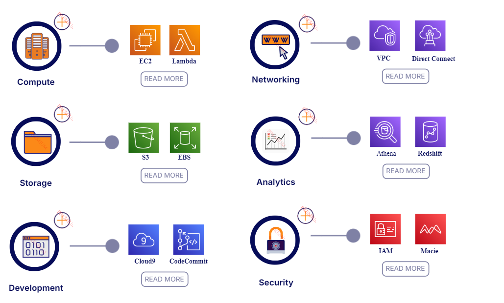
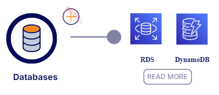
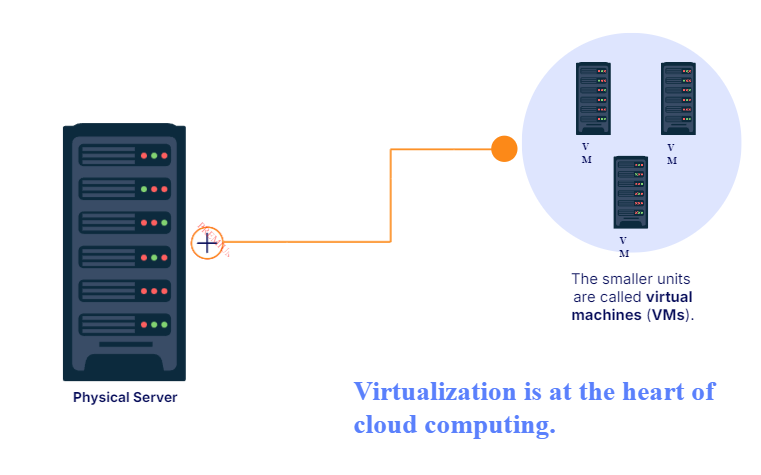

!!! important Cloud Computing
> - The on-demand delivery of IT resources over the [Internet](Redes/Chapter%201/01-Internet.md) with pay-as-you-go(Pay by the hour or the second for only what you use) pricing.
> - [See Advantages of Cloud Computing](AWS/Cloud%20Practitioner%20(CLF-C02)/01-Introduction%20to%20AWS/02-Advantages%20of%20Cloud%20Computing.md)

!!! important On-Demand Delivery
> AWS has the resources you need, when you need them. -> You only pay for what you use(No long-term commitments or upfront payments).
> - AWS owns and maintains the network-connected hardware required for these applicacion services, while you provision and use what you need via a Web Application.

!!! important Virtual Machines
> Virtualization lets you divide hardware resources on a single physical server into smaller units. -> Its at the heart of Cloud Computing.

