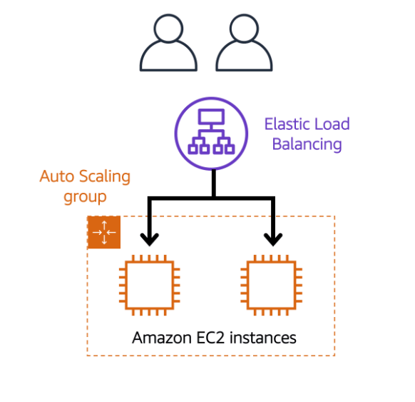
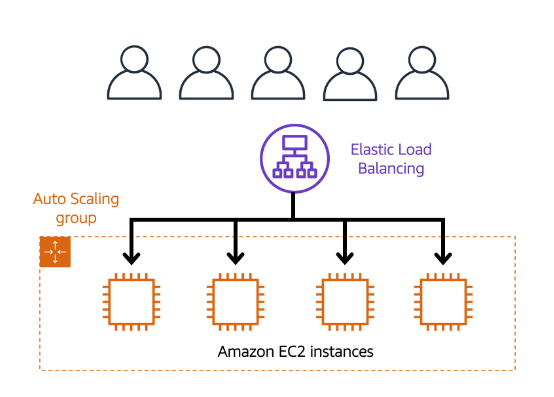

> [!IMPORTANT] Load Balancers
> Servers that forward traffic to multiple servers downstream.

> [!NOTE] Why use a Load Balancer?
- Spread load across multiple downstream instances.
- Expose a single point of access(DNS) to your application.
- Seamlessly handle failures of downstream instances.
- Do regular health checks to your instances.
- Provide SSL termination(HTTPS) for your websites.
- Enforce stickiness across zones.
- High Availability across zones.
- Separate public traffic from private traffic.

> [!IMPORTANT] Health Checks
> - Enable the Load Balancer to know if instances it forwards traffic to are available to reply to requests.
> - Is done on a port and a route(`/health` is common).
> - If the response is not 200(OK), then the instance is unhealthy.

---

> [!IMPORTANT] Directing Traffic with Elastic Load Balancing
> Automatically distributes incoming application traffic across multiple resources, such as [Amazon Elastic Compute Cloud(EC2)](AWS/Cloud%20Practitioner%20(CLF-C02)/02-Compute%20in%20the%20Cloud/01-Amazon%20Elastic%20Compute%20Cloud(EC2).md).
> - A load balancer acts as a single point of contact for all incoming web traffic to your Auto Scaling group.
> - As you add or remove Amazon EC2 instances in response to the amount of incoming traffic, these requests route to the load balancer first.

> [!PDF|yellow] [AWS Certified Solutions Architect Slides v39, p.128](AWS/Slides/AWS%20Certified%20Solutions%20Architect%20Slides%20v39.pdf#page=128&selection=8,0,8,29&color=yellow)
> > Types of load balancer on AWS
> 
> 

- Suppose that a few customers have come to the coffee shop and are ready to place their orders. 
- If only a few registers are open, this matches the demand of customers who need service. The coffee shop is less likely to have open registers with no customers. In this example, you can think of the registers as Amazon EC2 instances.

- Throughout the day, as the number of customers increases, the coffee shop opens more registers to accommodate them. 
- Additionally, a coffee shop employee directs customers to the most appropriate register so that the number of requests can evenly distribute across the open registers. You can think of this coffee shop employee as a load balancer.

---

> [!IMPORTANT] Sticky Sessions(Session Affinity)
> The same Client is always redirected to the same instance behind a Load Balancer.
> - Works for Classic, Application and Network Load Balancers.
> - Use Case: Make sure the User doesn't lose his session data.

