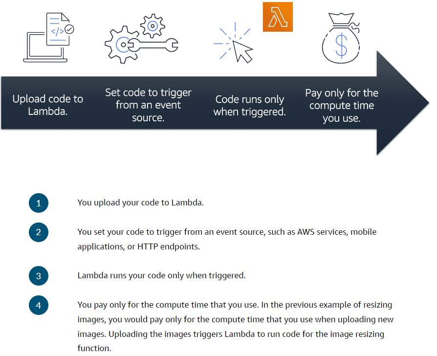
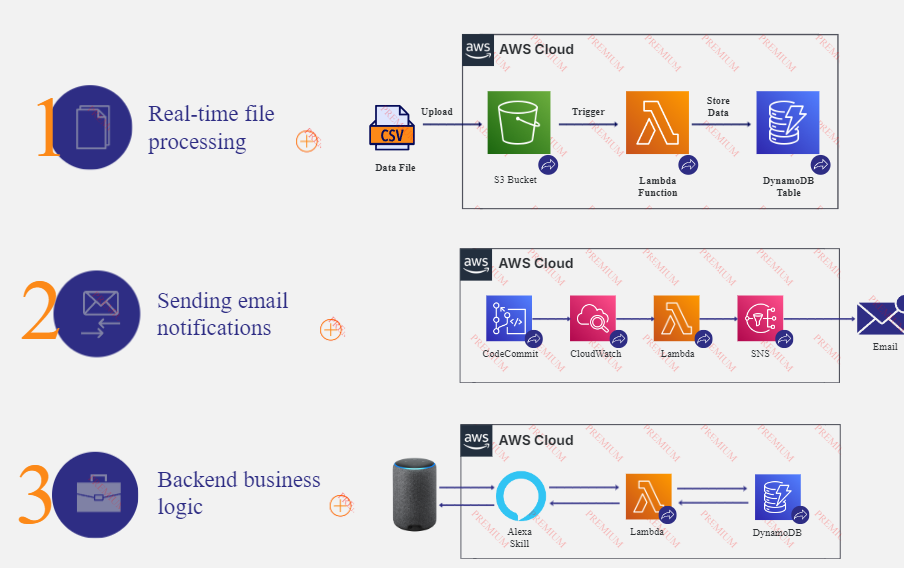

!!! important AWS Lambda
> - Is a [Serverless Computing](AWS/Cloud%20Practitioner%20(CLF-C02)/02-Compute%20in%20the%20Cloud/04-Serverless%20Computing.md) service that lets you run code without managing servers.
> - **Lets you run code without needing to provision or manage servers**.
> - You author application code, called functions, using many popular languages.
> - Scales automatically.
> - **You pay only for the compute time that you consume**. Charges apply only when your code is running. 

- Lambda is a building block for many serverless applications:

	
