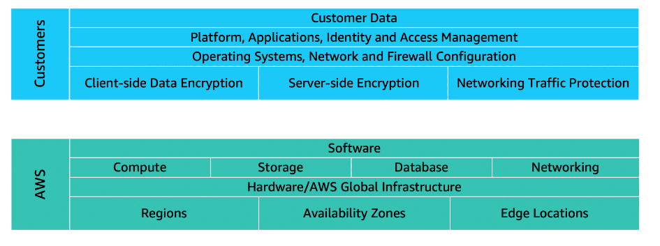

# AWS Shared Responsibility Model
- Security and Compliance is a shared responsibility between AWS and the customer.
- **AWS is responsible for some parts of your environment and you (the customer) are responsible for other parts**.
- The **shared responsibility model divides into customer responsibilities (commonly referred to as “security in the cloud”) and AWS responsibilities (commonly referred to as “security of the cloud”)**.
- Consider employing the [37-AWS Cloud Adoption Framework](AWS/Cloud%20Practitioner%20(CLF-C02)/09-Migration%20and%20Innovation/37-AWS%20Cloud%20Adoption%20Framework.md) and [41-The AWS Well-Architected Framework](AWS/Cloud%20Practitioner%20(CLF-C02)/10-The%20Cloud%20Journey/41-The%20AWS%20Well-Architected%20Framework.md) to plan and execute your digital transformation at scale.

	

## Customers: Security IN the Cloud
- **Customers are responsible for the security of everything that they create and put _in_ the AWS Cloud**.
- **The customer is responsible for managing security requirements for your content**(content to store, which services use and access to that content). He also control how access rights are granted, managed, and revoked.
- The security steps that you take will depend on factors such as the services that you use, the complexity of your systems, and your company’s specific operational and security needs.

## AWS: Security OF the Cloud
- **AWS is responsible for security _of_ the cloud.**
- **AWS operates, manages, and controls the components at all layers of infrastructure**. This includes areas such as the host operating system, the virtualization layer, and even the physical security of the data centers from which services operate. 
- Inherit controls -> Physical and Environmental controls.
- **AWS is responsible for protecting the global infrastructure that runs all of the services offered in the AWS Cloud**. This infrastructure includes AWS Regions, Availability Zones, and edge locations.
- AWS manages the security of the cloud, specifically the physical infrastructure that hosts your resources, which include:
	- Physical security of data centers
	- Hardware and software infrastructure
	- Network infrastructure
	- Virtualization infrastructure
- AWS provides several reports from third-party auditors. These auditors have verified its compliance with a variety of computer security standards and regulations.

## Shared Controls
- **Patch Management**: AWS is responsible for patching and fixing flaws within the infrastructure, but customers are responsible for patching their guest OS and applications.
- **Configuration Management**: AWS maintains the configuration of its infrastructure devices, but a customer is responsible for configuring their own guest operating systems, databases, and applications.
- **Awareness & Training**: AWS trains AWS employees, but a customer must train their own employees.